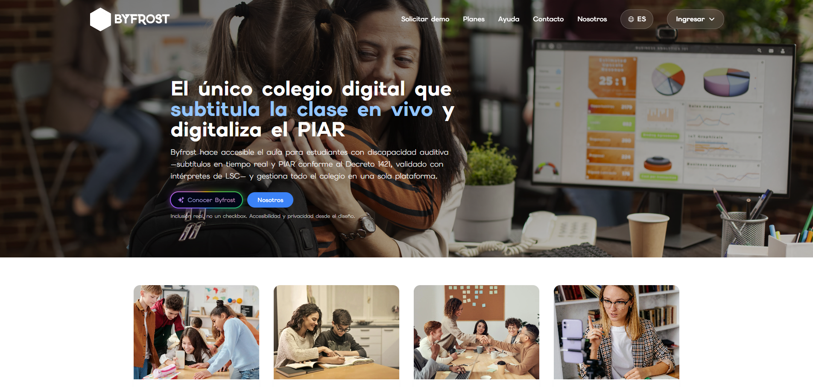
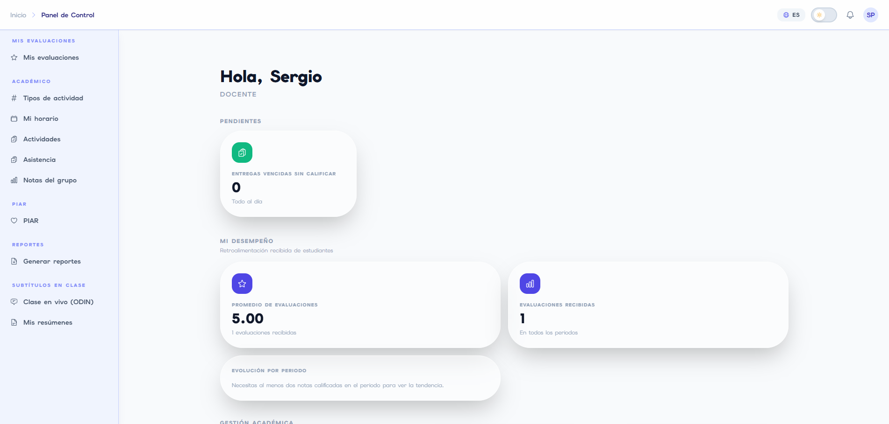
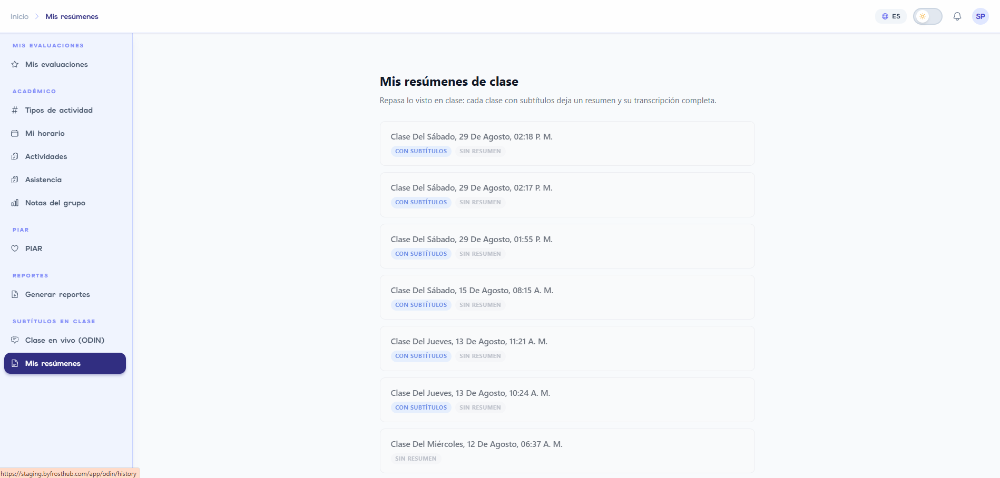
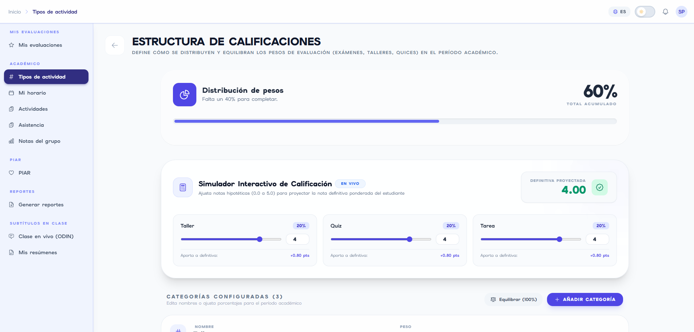
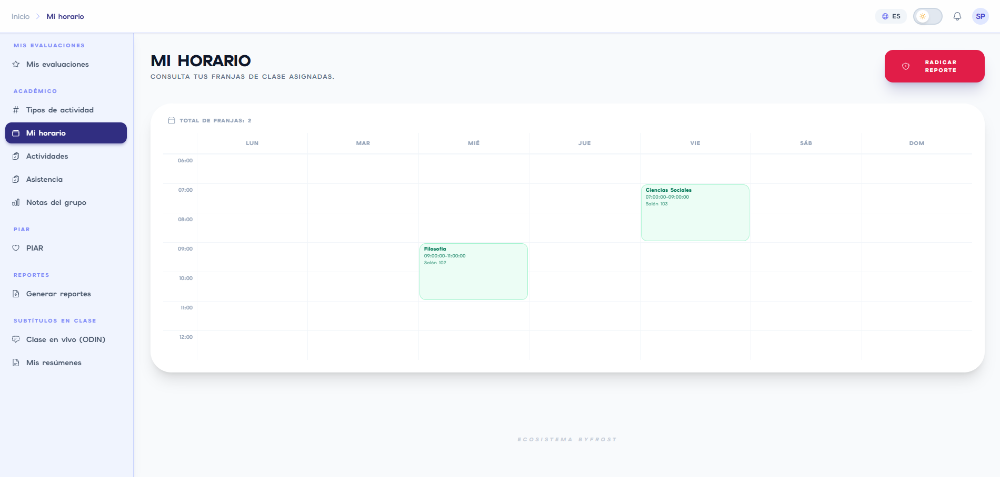

# 🌉 Byfrost

> Vitrina pública del proyecto. El código fuente vive en un repositorio privado — este repo solo muestra la arquitectura, el stack y capturas del producto.


**Byfrost** es una plataforma SaaS EdTech de última generación para instituciones escolares, construida bajo principios de **arquitectura multi-tenant**, **alta seguridad por diseño** y un claro enfoque de **inclusión educativa (PIAR)** con asistencia de inteligencia artificial en tiempo real.

---

## Arquitectura

El ecosistema adopta una metáfora de la mitología nórdica para organizar conceptualmente cada capa del sistema:

```
                  +-----------------------------------+
                  |      MIDGARD (Frontend SPA)       |
                  |  React 19 + TypeScript + Vite     |
                  +-----------------+-----------------+
                                    |
                                    v
                  +-----------------------------------+
                  |     RATATOSKR (API Gateway)       |
                  |  Reverse Proxy NGINX + Rate Limit |
                  +--------+-----------------+--------+
                           |                 |
            +--------------+                 +--------------+
            |                                               |
            v                                               v
+-----------------------+                       +-----------------------+
|  AESIR (Backend Core) |                       |     ODIN (AI Audio)   |
| Java 21 / Spring Boot |                       |    Python / FastAPI   |
+-----------+-----------+                       +-----------+-----------+
            |                                               |
            +-----------------------+-----------------------+
                                    |
                                    v
                  +-----------------------------------+
                  |   BYFROST DATA (Persistencia)     |
                  |     PostgreSQL 16 + Redis 7       |
                  +-----------------------------------+
```

### Componentes

- **Midgard — Frontend Web**: React 19, TypeScript, Vite, Tailwind CSS, Framer Motion, TanStack Query, i18next. SPA modular por dominios funcionales, multi-idioma, modo oscuro.
- **Ratatoskr — API Gateway**: NGINX (Alpine / Reverse Proxy). Punto único de entrada HTTP/WebSocket, rate limiting, cabeceras de seguridad y CORS.
- **Aesir — Core Backend**: Java 21, Spring Boot 3.5, JPA/Hibernate, Lombok, JJWT, Argon2id. Monolito modular organizado en dominios independientes.
- **Odin — AI & Audio Streaming**: Python 3.11+, FastAPI, WebSockets. Servicio de IA en tiempo real que aloja dos motores: transcripción en vivo (Huginn) y analítica predictiva.
- **Byfrost Data**: PostgreSQL 16 + Redis 7.

### Módulos de negocio (Aesir)

| Módulo | Dominio |
| :--- | :--- |
| **Heimdall** | Autenticación, identidad, sesiones multi-dispositivo, roles, hashing Argon2id |
| **Forseti** | Gobernanza multi-tenant institucional (colegios, sedes, aulas) |
| **Mimir** | Core académico: matrículas, calificaciones, asistencia, horarios, convivencia escolar |
| **Hermod** | Motor de notificaciones (SSE + email) y CRM de admisiones |
| **Idunn** | Suscripciones institucionales, planes y facturación SaaS |
| **Sigrun** | Inclusión escolar — Planes Individuales de Ajustes Razonables (PIAR) |

### Huginn — Subtitulado en tiempo real (dentro de Odin)

El motor de accesibilidad más visible de Byfrost: transcribe la voz del docente en el aula y la envía como subtítulos en vivo a la tableta del estudiante sordo, con una latencia objetivo menor a 2 segundos.

- Captura de audio por WebSocket, nunca se guarda en disco crudo
- Pipeline de voz-a-texto + limpieza con IA (elimina muletillas y ruido verbal en tiempo real)
- Al cerrar la clase, la transcripción se cifra con una llave por institución (gestionada por Heimdall) antes de persistirse
- Diseñado para operar con proveedores intercambiables (nube en piloto, modelos locales en producción) sin cambiar código

---

## Seguridad y buenas prácticas

- Criptografía de contraseñas con **Argon2id**
- Aislamiento multi-tenant por `TenantId`
- Auditoría inmutable de cambios de calificaciones
- Rate limiting en el gateway contra fuerza bruta y DoS

---

## Capturas

**Landing page**


**Panel del docente**


**Subtítulos y resúmenes de clase (Huginn/Odin)**


**Estructura de calificaciones**


**Horario**


---

## Contacto

👤 [Iván Ruiz](https://github.com/IvanByfrost) · [LinkedIn](https://www.linkedin.com/in/ivanruiz-edtech/) · [Email](mailto:idruizv@gmail.com)
